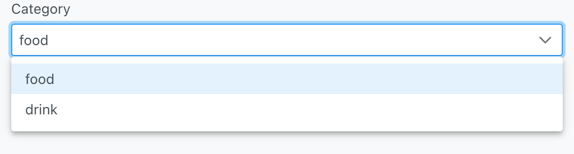

## Entity in Fluent CMS

### Definition

An **entity** in Fluent CMS is a conceptual representation of a real-world object or concept within the content management system. It is similar to a database table but more flexible and abstract. Entities have attributes (fields) that store data, and they can participate in various relationships with other entities.

### Attributes

Entities have attributes that define their properties or characteristics. These attributes can be of different types:

1. **Normal Attributes**: Simple fields that directly store data, similar to columns in a database table.
2. **Lookup Attributes**: Represent many-to-one relationships, where an entity references a single instance of another entity.
3. **Crosstable Attributes**: Represent many-to-many relationships, where an entity references multiple instances of another entity.

### Entities and Database Tables
- Direct Mapping: Often, each entity maps directly to a single database table. For example, a User entity might correspond directly to a Users table in the database.
- Shared Tables: In some cases, multiple entities might be stored in a single table. This is achieved using a discriminator column to distinguish between different entities.
## Attributes in Fluent CMS

### Overview

In Fluent CMS, attributes define the properties and characteristics of entities. Each attribute is described using a schema that outlines its data type, display type, and other relevant information.

### Key Properties of Attributes

1. **Field**
   - **Type**: `string`
   - **Description**: Field Name of the Attribute.
   - **Example**: `"title"`, `"description"`

2. **Header**
   - **Type**: `string`
   - **Description**: The display name of the attribute in the table header.
   - **Example**: `"Title"`, `"Description"`

3. **In List**
   - **Type**: `boolean`
   - **Description**: Indicates if the attribute should be displayed in the list page.
   - **Default**: `true`

4. **In Detail**
   - **Type**: `boolean`
   - **Description**: Indicates if the attribute should be displayed in the detail page.
   - **Default**: `true`

5. **Is Default**
   - **Type**: `boolean`
   - **Description**: Indicates if the attribute is system-generated.
   - **Example**: `true`, `false`

6. **Data Type**
   - **Type**: `string`
   - **Description**: Specifies the database type of the attribute.
   - **Enum Values**:
      - `"String"`: Short string, typically up to 255 characters (`VARCHAR(255)`).
      - `"Text"`: Long string, with no specific length limit, stored as `TEXT`.
      - `"Int"`: Integer, requiring parsing of URL query parameters to an integer.
      - `"Datetime"`: Timestamp, requiring parsing of URL query parameters to a datetime.

7. **Display Type**
   - **Type**: `string`
   - **Description**: Specifies how the attribute should be displayed in the UI.
   - **Enum Values**:
      - `"text"`: Single line input.
      - `"textarea"`: Multi-line input.
      - `"editor"`: WYSIWYG rich text editor.
      - `"number"`: Numeric input.
      - `"datetime"`: Date-time picker.
      - `"date"`: Date picker.
      - `"image"`: Stores the URL of an image.
      - `"gallery"`: Multiple image URLs, separated by commas.
      - `"file"`: Stores the URL of a file.
      - `"dropdown"`: Options input as comma-separated values.
      - `"lookup"`: References another table, detailed in lookup attributes.
      - `"multiselect"`: Allows selection of multiple options.
      - `"crosstable"`: Detailed in crosstable attributes.

8. **Options**
   - **Type**: `string`
   - **Description**: Specifies options for certain display types.
   - **Example**:
      - For `"dropdown"` and `"multiselect"`: Comma-separated values.
      - For `"lookup"`: Name of the lookup entity.
      - For `"crosstable"`: Name of the crosstable entity.
## Lookup Attributes in Fluent CMS: Many-to-One Relationship
### Concept
In a many-to-one relationship, each record in a table can be associated with one record in another table. This relationship is commonly used to organize data into categories or classifications. For example, a blog post may belong to a single category, but a category can have many blog posts.

### Database Schema

Let's take the example of blog posts and categories:

1. **Categories Table**:
    - `id` (Primary Key)
    - `name` (Category Name)

2. **Posts Table**:
    - `id` (Primary Key)
    - `title` (Post Title)
    - `content` (Post Content)
    - `category_id` (Foreign Key referencing Categories table)

### User Interface (UI)
When creating or editing a post, the `category_id` field should be rendered as a dropdown menu. This dropdown should list all available categories, allowing the user to select one.  

## Crosstable Attributes in Fluent CMS: Many-to-Many Relationship

### Concept
In a many-to-many relationship, each record in one table can be associated with multiple records in another table, 
and vice versa. For example, a blog post can have multiple authors, and each author can write multiple posts.

### Database Schema
To manage a many-to-many relationship, a join table (crosstable) is used to link the two entities.

1. **Posts Table**:
   - `id` (Primary Key)
   - `title` (Post Title)
   - `content` (Post Content)

2. **Authors Table**:
   - `id` (Primary Key)
   - `name` (Author Name)

3. **PostsAuthors Table** (Join Table):
   - `post_id` (Foreign Key referencing Posts table)
   - `author_id` (Foreign Key referencing Authors table)

### User Interface (UI)
When creating or editing a post, the authors should be rendered in a table format where users can select or deselect authors for the post.

## View in Fluent CMS

### Definition

In Fluent CMS, a **view** is a structured representation of an entity that serves as a public API endpoint. Views are designed to present data from entities while adhering to **performance** and **security** considerations.

### Key Characteristics of a View

1. **Entity Reference**: Each view references a specific entity. This means the data displayed in the view is derived from the referenced entity's attributes and relationships.

2. **Public API Correspondence**: A view corresponds to a public API endpoint. This endpoint is designed to handle requests efficiently and securely, protecting against potential threats such as DDoS attacks.

3. **Limited Query Parameters**: To protect the system from DDoS attacks, the API endpoint associated with a view accepts a limited set of query parameters. This restriction ensures that only necessary data is processed, reducing the risk of overloading the server.

4. **Predefined Order**: Views have a predefined order, usually defined with consideration of the table indexes to optimize query performance. This ensures that data retrieval is efficient and fast.

5. **Predefined Filters**: Views come with predefined filters that can accept dynamic parameters from the URL query string. These filters hide the details of the filter fields and operators from the user, providing a simplified and secure way to query data.

6. **No Pagination**: Views do not implement traditional pagination using SQL's `OFFSET`. Instead, they use a more efficient method for handling large datasets. For example, instead of:
   ```sql
   SELECT * FROM posts ORDER BY publish_time OFFSET 1000
   ```
   A more efficient query would be:
   ```sql
   SELECT * FROM posts WHERE publish_time < last_publish_time
   ```
   This approach reduces the cost and inefficiency associated with large offsets in SQL queries.

### Example: Implementing a View for Posts

#### Entity Reference

The view references the `Posts` entity.

#### Public API Endpoint

The view corresponds to an API endpoint, such as `/api/views/latest-posts`.

#### Limited Query Parameters

The API endpoint accepts limited query parameters to ensure efficient processing and security. For example:
- `?slug=<slug>`: to get posts equals certain slug.

#### Predefined Order

The view orders posts by their `publish_time`, considering the table index on this column for efficient retrieval:
```sql
SELECT * FROM posts ORDER BY publish_time DESC
```

#### Efficient Data Retrieval

Instead of using `OFFSET` for pagination, the view retrieves data based on a specific condition, such as `publish_time`:
```sql
SELECT * FROM posts WHERE publish_time < ? ORDER BY publish_time DESC
```
This method ensures efficient data retrieval, especially for large datasets.

## Filters/Constraint in Fluent CMS
### Constraints

Constraints represent specific conditions or rules applied to query data.

```json
{
  "match": ">", 
  "value": "18"
}
```

- **match**: Specifies the comparison operation (e.g., `=` for equality, `<>` for inequality, `>` for greater than, `<` for less than).
- **value**: The value against which the constraint is applied.

### Filters

Filters combine multiple constraints and specify attributes (fields) to filter data.

```json
{
  "fieldName": "age",
  "operator": "and",
  "constraints": [
    {"match": ">", "value": "18"},
    {"match": "<=", "value": "30"}
  ]
}
```

- **fieldName**: Specifies the database column or attribute name.
- **operator**: Specifies how multiple constraints within the filter should be logically combined (`AND`, `OR`, `NOT`).
- **constraints**: Array of constraints, where each constraint corresponds to a condition on the specified `fieldName`.

### SQL Translation Example

For example, a filter object:

```json
{
  "fieldName": "age",
  "operator": "and",
  "constraints": [
    {"match": ">", "value": "18"},
    {"match": "<=", "value": "30"}
  ]
}
```

could translate into the following SQL query fragment:

```sql
WHERE age > 18 AND age <= 30
```

This SQL fragment filters rows where the `age` column satisfies both conditions specified in the filter.

### Usage Contexts

- **Public API**: Constraints and filters are predefined, only allow limited constraint value can be passed from URL Query Parameter.
- **Admin Panel API**: Complex filters can be encoded in query strings (using packages like `qs` for handling).