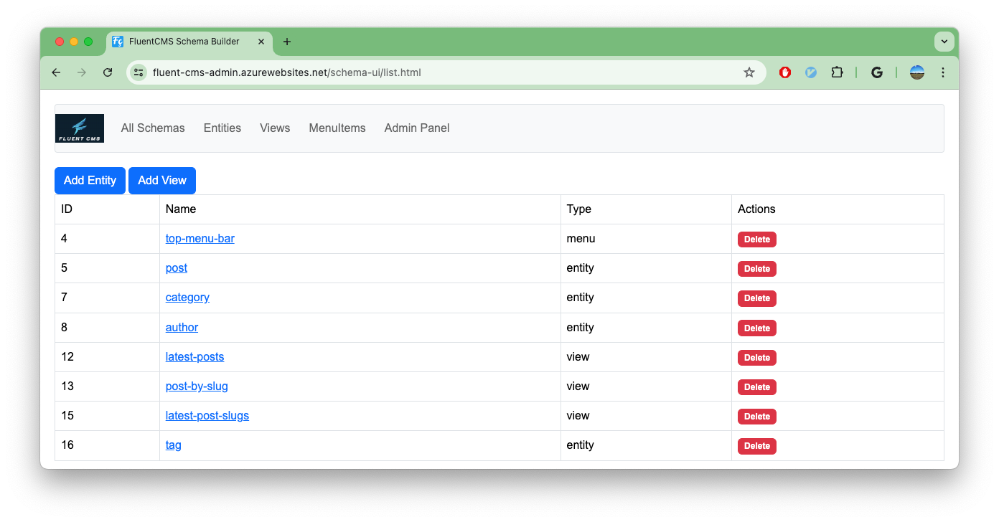
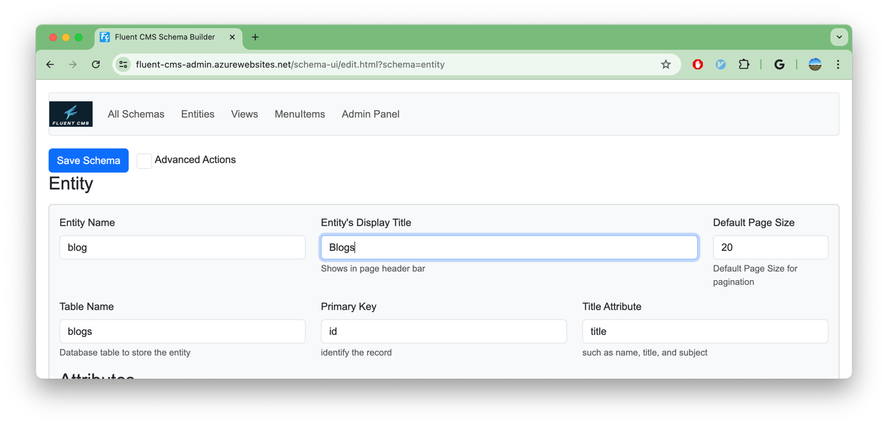
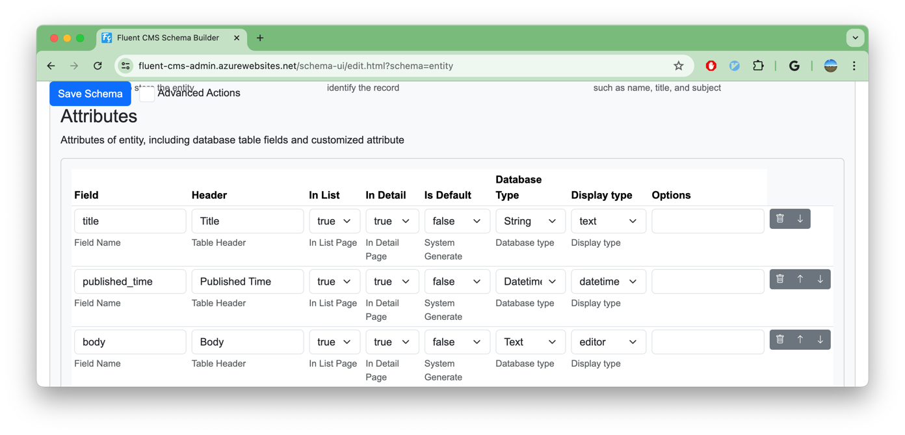
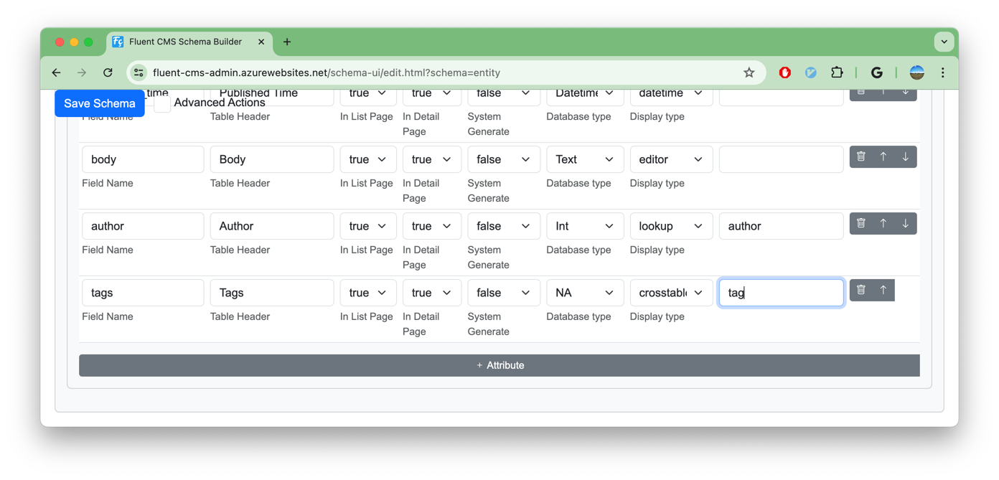
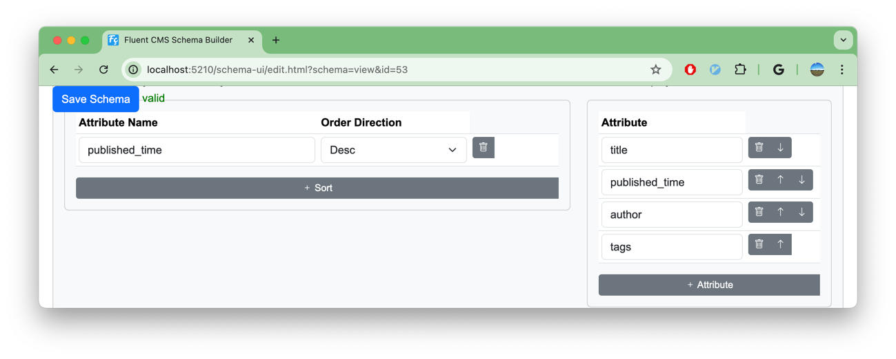
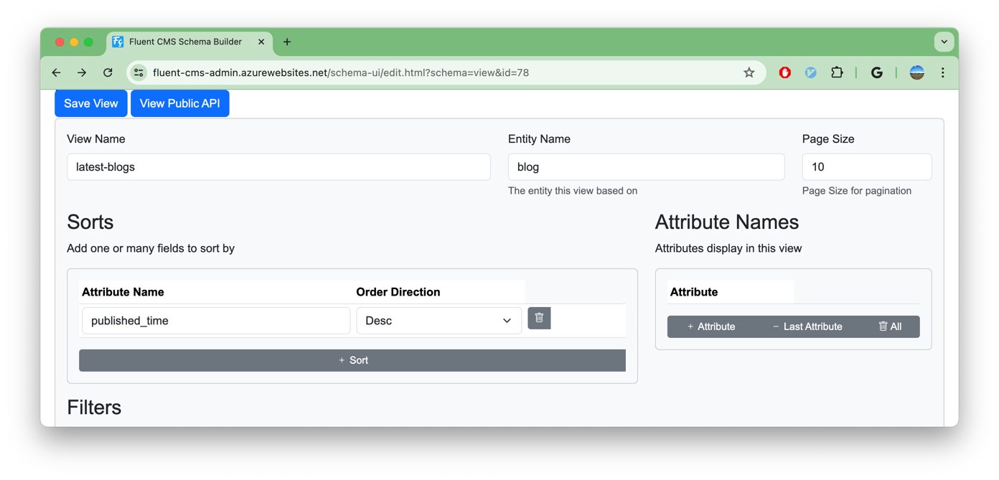
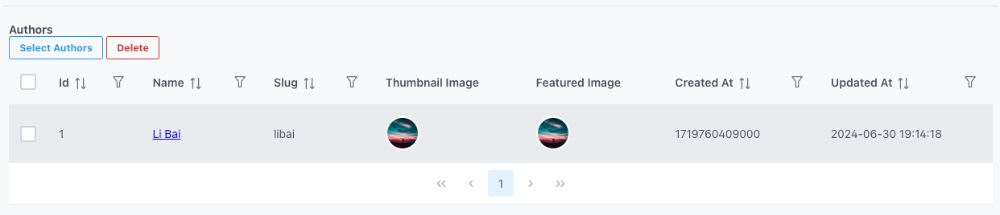

# Quick Start
For this tutorial, I will walk you though how to build blog website backend APIs from scratch.
By the end of this tutorials, you have:
1. CRUD pages for manage content in Admin Panel.
2. REST APIs for mobile and web clients.

With Fluent CMS, there's no need for coding—just some configuration.

## Build Schema

### Add entity
1. Login to Admin Panel
    - Go to Admin Panel https://fluent-cms-admin.azurewebsites.net/ or http://localhost:5210 ,
    - use Email `admin@cms.com`, Password `Admin1!`         
      
2. Navigate to Schema Builder
    - click the Menu Item  `Schema Builder`         
      
3. Access the Add Entity Page by
    - click the Menu Item  `Add Entity`      
   
4. Fill in the Entity Detail
    - On the Add Entity Page
        - Entity name: `blog`
        - Table name: `blogs`
        - Primary Key: `id`
        - Title Attribute: `title`
        - Default Page Size: `20`
        - Entity Title : `Blogs`                
      
### Add Fields/Attributes
1. Add attributes to the entity
    - The system will add 3 system fields `id`, `created_at`, `updated_at` automatically.
    - Add The following attributes:
        - `title`
        - `published_time`   {Database Type: `Datetime`, Display Type: `dateTime`}
        - `body` {Database Type: `Text`, Display Type: `Editor`}
    - Click the `Update Database` button to save schema and create a table in database.  
   
### Add Entity Relationships
   - Add a lookup Attribute `author`
     - Field : `author`
     - Header : `Author`
     - Database Type : `int`
     - Display Type : `crosstable`
     - Option: `author`, author is another entity's name
   - Add a crosstable Attribute `tags`
     - Field : `tags`
     - Header: `Tags`
     - In List Page: `false`
     - Database Type: `NA`
     - Display Type : `corsstable`
       - Option: `tag`, tag is another entity's name
       
   - Click the `Save Schema` button, to create tables in database.
   - Click the `Edit Content` button, to add some data.see [Manage Content](#manage-content-in-admin-panel) 
### Add Public API
Fluent CMS provides a set of CRUD Rest APIs for Admin Panel, these APIs are protected by Authentication.
We don't want expose these APIs to public user directly for security and performance concerns.  
We want expose API to public by carefully selected
- Attributes to expose
- Order
- Filter
- Page Size of each request

Follow the follow steps to define a public API
1. Fill the View Detail
    - Navigate to Schema Builder
    - Click the Menu Item `Add View`
    - Fill the View Detail
        - View Name : `lastest-blog`
        - Entity Name : `blogs`
        - Page Size : 10
    
2. Fill Sort Detail
    - Click `+ row` button
    - Input the Sort Detail
        - Attribute Name : `published_time`
        - Order Direction: `Desc`
    - Input Attribute 
      - id,
      - title
      - published_time,
      - tags
    - Click `Save Schema` button
   
3. Test the public API
-  Click the button `View Public API`

## Manage Content in Admin Panel

### Add Data for Entity `Blog`
1. Login to Admin Panel
   - Go to Admin Panel https://fluent-cms-admin.azurewebsites.net/ or http://localhost:5210 ,
   - use Email `admin@cms.com`, Password `Admin1!`         
2. Click button `Create New Blogs` 

3. Input data

4. Click button `Save Blogs`

### Add Tags
1. Click the button `Select Tags` to Add Post Related Tag

2. Click the button `Delete Tags` to Delete Tag