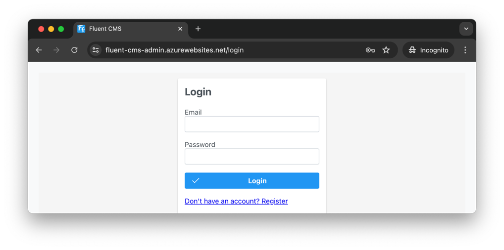
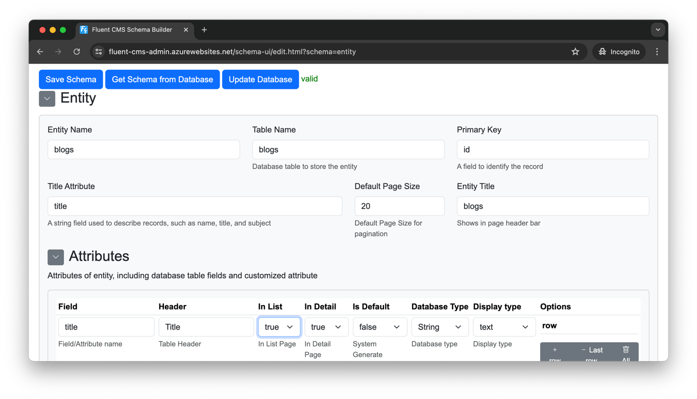
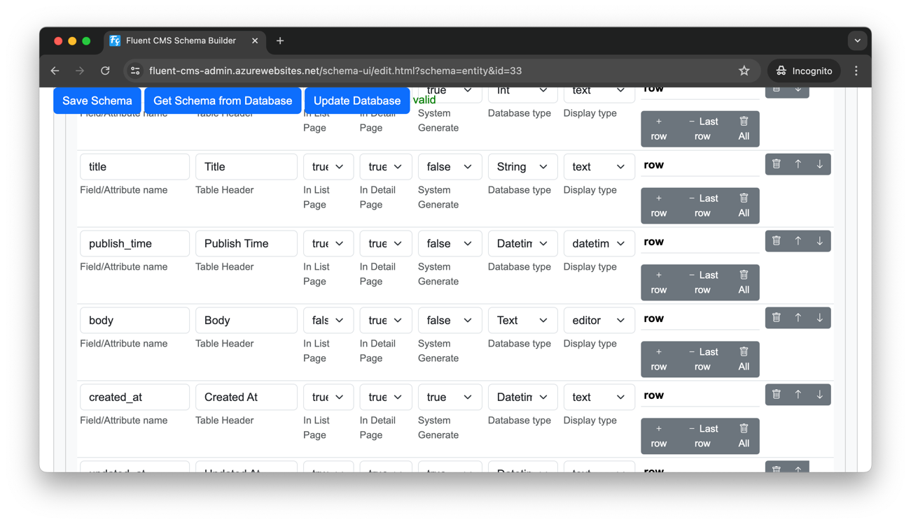
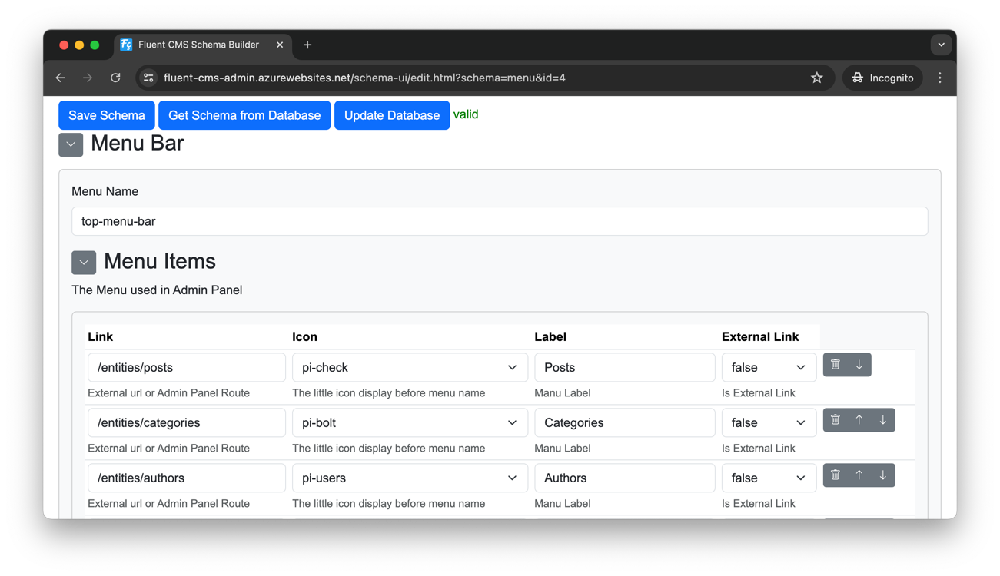
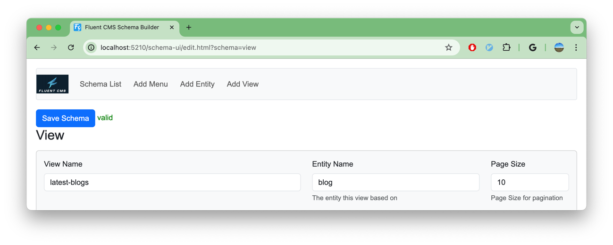
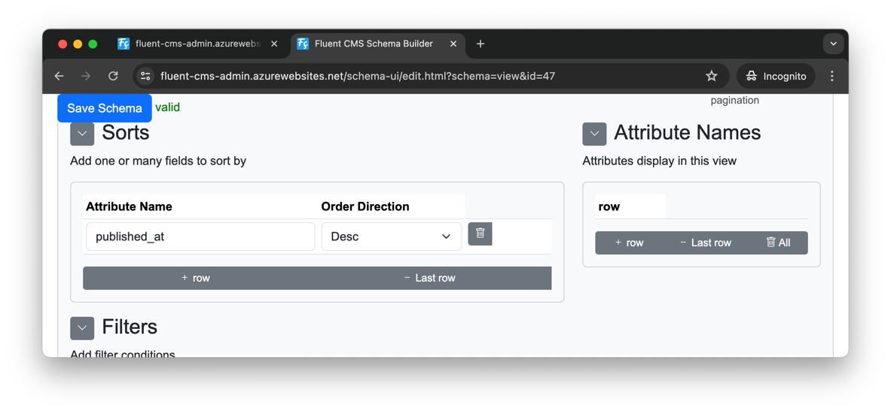
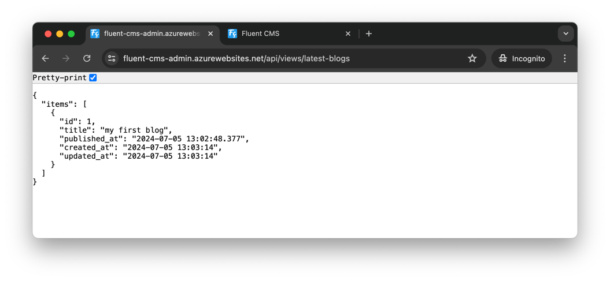

# Quick Start
For this tutorial, I will walk you though how to build cooking blog website from scratch.
By the end of this tutorials, you have:
1. An admin panel to manage blog content.
2. REST APIs for mobile and web clients.

With Fluent CMS, there's no need for coding—just some configuration.

### Add entity
1. Login to Admin Panel
    - Go to Admin Panel https://fluent-cms-admin.azurewebsites.net/,
    - use Email `admin@cms.com`, Password `Admin1!`         
      
2. Navigate to Schema Builder
    - click the Menu Item  `Schema Builder`         
      
3. Access the Add Entity Page by
    - click the Menu Item  `Add Entity`      
      
4. Fill in the Entity Detail
    - On the Add Entity Page
        - Entity name: `blogs`
        - Table name: `blogs`
        - Primary Key: `id`
        - Title Attribute: `title`
        - Default Page Size: `20`
        - Entity Title : `Blogs`                
          
5. Add attributes to the entity
    - The system will add 3 system fields `id`, `created_at`, `updated_at` automatically.
    - Add The following attributes:
        - `title`
        - `published_time`   {Database Type: `Datetime`, Display Type: `dateTime`}
        - `body` {Database Type: `Text`, Display Type: `Editor`}
    - Click the `Update Database` button to save schema and create a table in database.  
      
6. Add Menu item for Admin Panel's Top Menu Bar
    - Click `Schema List`,
    - Edit the top-menu-bar, add a new item,
        - Link: `/entity/blogs`
        - Label: `Blogs`      
          
7. Manage Content in Admin Panel
    - Click the `Fluent CMS` logo, go to Admin Panel
    - You can see a new menu item `Blogs` is added,
    - now you can manage content   
      
## Add Relationship

## Add Public API
Fluent CMS generates a set of CRUD Rest APIs, these APIs are protected by Authentication.
We don't want expose Admin CRUD APIs to public user directly, We want expose API to public by carefully selected
- Attributes to expose
- Order
- Filter
- Page Size for pagination

Follow the follow steps to define a public API
1. Fill the View Detail
    - Navigate to Schema Builder
    - Click the Menu Item `Add View`
    - Fill the View Detail
        - View Name : `lastest-blog`
        - Entity Name : `blogs`
        - Page Size : 10
          
2. Fill Sort Detail
    - Click `+ row` button
    - Input the Sort Detail
        - Attribute Name : `published_at`
        - Order Direction: `Desc`
    - Click `Save Schema` button
      
3. Test the public API
- Access https://fluent-cms-admin.azurewebsites.net/api/views/latest-blogs from browser
  
