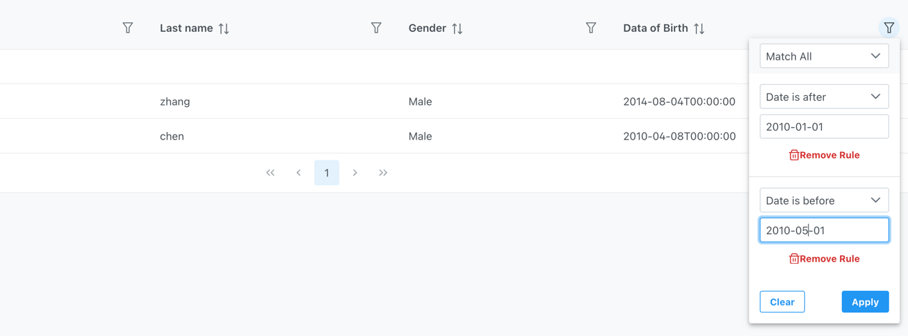

# Building a Generic Query API in ASP.NET Using URL Query Strings with QS and SQLKata

For web applications, it's often desirable to provide users with a flexible way to quickly find data. For example, consider a table named `Student` with the following fields:

1. **StudentID** (Primary Key) - A unique identifier for each student.
2. **FirstName** - The student's first name.
3. **LastName** - The student's last name.
4. **DateOfBirth** - The student's date of birth.
5. **Gender** - The student's gender.

Suppose we want to find students who are male and were born between January 1, 2010, and May 1, 2010.

To implement this feature, both the backend and frontend need to be developed:

### Backend
Using LINQ, the filter would be:
```csharp
Students.Where(student => student.Gender == "Male" && student.DateOfBirth > '2010-01-01' && student.DateOfBirth < '2010-05-01');
```
### Frontend
A form can be added to the webpage, and the input can be passed to the backend via a query string:
```
/students/?gender=Male&start=2010-01-01&end=2010-05-01
```
While this approach works, manually coding each entity's filter can be time-consuming. Consider a system with entities like `Teacher`, `Classroom`, and `Subject`, each having different query requirements. This would result in a lot of repetitive work.

## Steps to Implement a Flexible Query API
The endpoint looks like `/api/entities/student?Gender[equals]=Male&DateOfBirth[gt]=2010-01-01&DateOfBirth[lt]=2010-05-01`, the difference between this endpoint and above endpoint is
1. Instead of creating apis for entity `/api/student`, `/api/teacher`, `/api/classroom`, `/api/subject`,  only one api /entities is needed.
2. Instead of only putting query value, we also put `field` and `match mode` in to query parameter,  `Gender[equals]=Male&DateOfBirth[gt]=2010-01-01&DateOfBirth[lt]=2010-05-01` will be translated to `Gender == "Male" && DateOfBirth > '2010-01-01' && DateOfBirth < '2010-05-01'`


### 1. `Filter` Objects
To represent the query condition `student.Gender="Male" and (student.DateOfBirth > '2010-01-01' and student.DateOfBirth < '2010-05-01')`, we define C# classes for `Constraint` and `Filter`:

```csharp
public sealed class Constraint
{
    public string Match { get; set; } = "";
    public string Value { get; set; } = "";
}

public sealed class Filter
{
    public string FieldName { get; set; }
    public List<Constraint> Constraints { get; set; }
}
```

The query condition can be represented as two filters:

```csharp
var filters = new List<Filter>
{
    new Filter
    {
        FieldName = "Gender",
        Constraints = new List<Constraint>
        {
            new Constraint { Match = "equals", Value = "Male" }
        }
    },
    new Filter
    {
        FieldName = "DateOfBirth",
        Operator = "and",
        Constraints = new List<Constraint>
        {
            new Constraint { Match = "gt", Value = "2010-01-01" },
            new Constraint { Match = "lt", Value = "2010-05-01" }
        }
    }
};
```

### 2. Serialize and Deserialize
The frontend builds the filters, serializes them as a string, and passes the `filters` to the backend API. 
One convenient way to serialize objects is to convert them to JSON. However, URL-encoded JSON is hard to read. 
A more human-friendly way is to use the QS library(or follow it's patten if your client is not use javascript), 
which encodes objects into query strings like `Gender[equals]=Male&DateOfBirth[gt]=2010-01-01&DateOfBirth[lt]=2010-05-01`.


### 3. Decode `Filter` Objects in ASP.NET Core API
For simple objects, ASP.NET Core can decode the object for us:

```csharp
public class Pagination
{
    public int Offset { get; set; }
    public int Limit { get; set; }
}

// In a HttpGet function in a controller
public async Task<ActionResult<ListResult>> List(string entityName, [FromQuery] Pagination? pagination)
```

For complex objects, we must decode them manually. We use the following statement to get a `Dictionary<string, StringValues>`:

```csharp
var qs = QueryHelpers.ParseQuery(HttpContext.Request.QueryString.Value);
```

We can then iterate through the dictionary to construct our `filters` object.

### 4. Convert `Filter` Objects to SQL
Using SQLKata, we can easily map `filter` objects to `SqlKata.Query` objects. The `kateExecutor` can compile and execute the SQL and return a list of objects, which can be converted to json .

For each match mode, we can call a SQLKata `Where` function to apply the query:

```csharp
public sealed class Constraint
{
    public string Match { get; set; } = "";
    public Result<Query> Apply(Query query, string field)
    {
        return Match switch
        {
            Matches.StartsWith => query.WhereStarts(field, GetValue()),
            Matches.Contains => query.WhereContains(field, GetValue()),
            Matches.NotContains => query.WhereNotContains(field, GetValue()),
            Matches.EndsWith => query.WhereEnds(field, GetValue()),
            Matches.EqualsTo => query.Where(field, GetValue()),
            Matches.NotEquals => query.WhereNot(field, GetValue()),
            Matches.NotIn => query.WhereNotIn(field, ResolvedValues),
            Matches.In => query.WhereIn(field, ResolvedValues),
            Matches.Lt => query.Where(field, "<", GetValue()),
            Matches.Lte => query.Where(field, "<=", GetValue()),
            Matches.Gt => query.Where(field, ">", GetValue()),
            Matches.Gte => query.Where(field, ">=", GetValue()),
            Matches.DateIs => query.WhereDate(field, GetValue()),
            Matches.DateIsNot => query.WhereNotDate(field, GetValue()),
            Matches.DateBefore => query.WhereDate(field, "<", GetValue()),
            Matches.DateAfter => query.WhereDate(field, ">", GetValue()),
            Matches.Between => ResolvedValues?.Length == 2
                ? query.WhereBetween(field, ResolvedValues[0], ResolvedValues[1])
                : Result.Fail("should provide two values for between"),
            _ => Result.Fail($"{Match} is not supported")
        };
    }
}
```

### 5. Building Filters with a React UI Library
A React component like [PrimeReact DataTable](https://primereact.org/datatable/) is well-suited for building filter objects. It supports most of the above match modes and provides a powerful UI for constructing queries.


### Conclusion
While LINQ is a powerful tool for building queries, using QS and SQLKata can provide more flexibility in certain scenarios. By automating the creation and parsing of query filters, we can reduce repetitive work and improve the maintainability of our code.