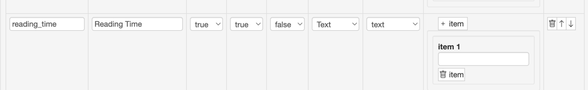
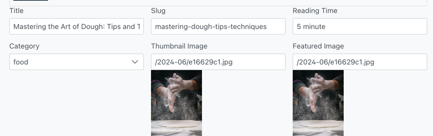
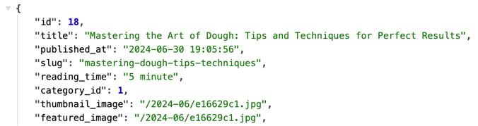

# Fluent CMS
## System overview

- Frontend Portal Live demo: https://fluent-cms-ui.azurewebsites.net/
- Admin UI live demo: https://fluent-cms-admin.azurewebsites.net/
  - user name: admin
  - password: Admin1!
- Schema Editor: https://fluent-cms-admin.azurewebsites.net/schema-ui/list.html

## Why another CMS
The typical workflow for web development involves:


The normal workflow for web development is:
1. Backend Developers creating tables and defining relationships in databases.
2. Backend Developers creating APIs to perform CRUD (Create, Read, Update, Delete) operations on data.
3. Frontend Developers creating web pages that call these APIs.

Although ORMs and UI frameworks can reduce some of this work, developers often find themselves repeating the same tasks. 
As projects progress, adding or removing fields in tables necessitates changes to both the frontend and backend code, 
which in turn requires redeploying both applications.

Fluent CMS addresses this issue by not hardcoding the backend and frontend to specific entities. 
Instead, they read the schema definition to generate APIs. 
This means that changing an entity attribute only requires updating the schema definition in the schema builder.

For example, in the provided food/cooking blog demo, the product manager wants to add a "reading_time" attribute to the post entity.   


To meet this requirement, developers do not need to change any code. The workflow is as follows:

Add a "reading_time" field to the "posts" table.
In the schema builder, add the "reading_time" attribute.    


The new field will appear in the admin portal:    


And the attribute will be added to the REST API JSON payload:    


## Play With it using Docker
Assuming you have Docker and Docker Compose installed, follow these steps:

1. clone the repository
```shell
git clone https://github.com/fluent-cms/fluent-cms
```
2. bring up services
```shell
cd fluent-cms-sqlite-docker
docker-compose up
```
3. You can now explore the app:
-   Manage content at http://localhost:8080 using username admin@cms.com and password Admin1!
-   View the demo frontend at http://localhost:3000

## Development

### Server
- asp.net core
- entity framework core
- sqlkata, it using dapper ORM behind the scene(https://sqlkata.com/)

Both entity framework and sqlkata can abstract query from specific Database dialect, so I extract database access to
another layer, currently fluent-cms support postgres sql, it can easily support SQL Server and MySQL in the future. 

