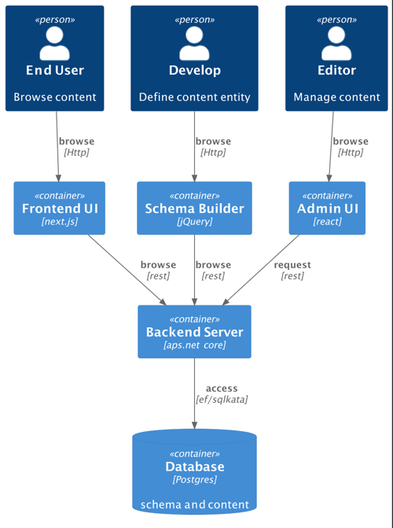
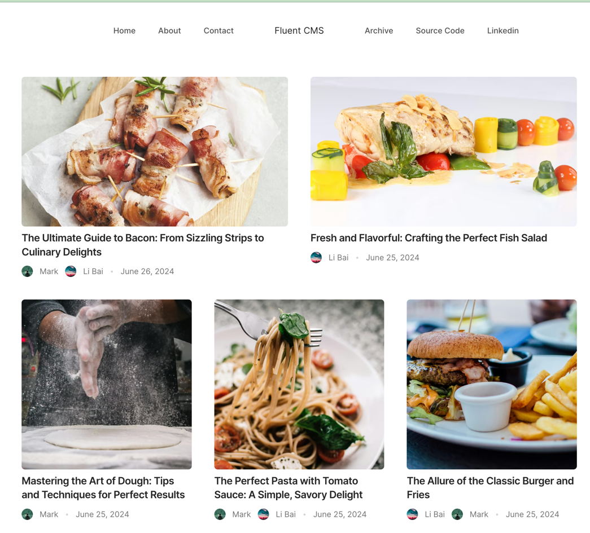
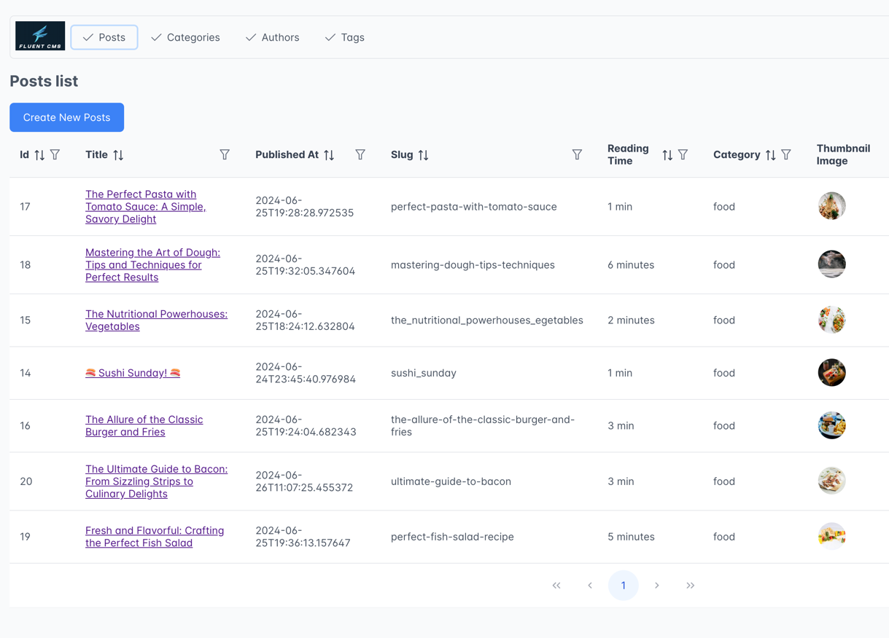
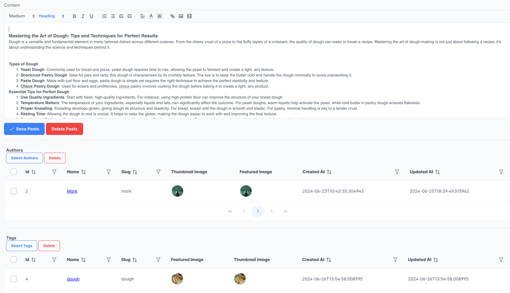
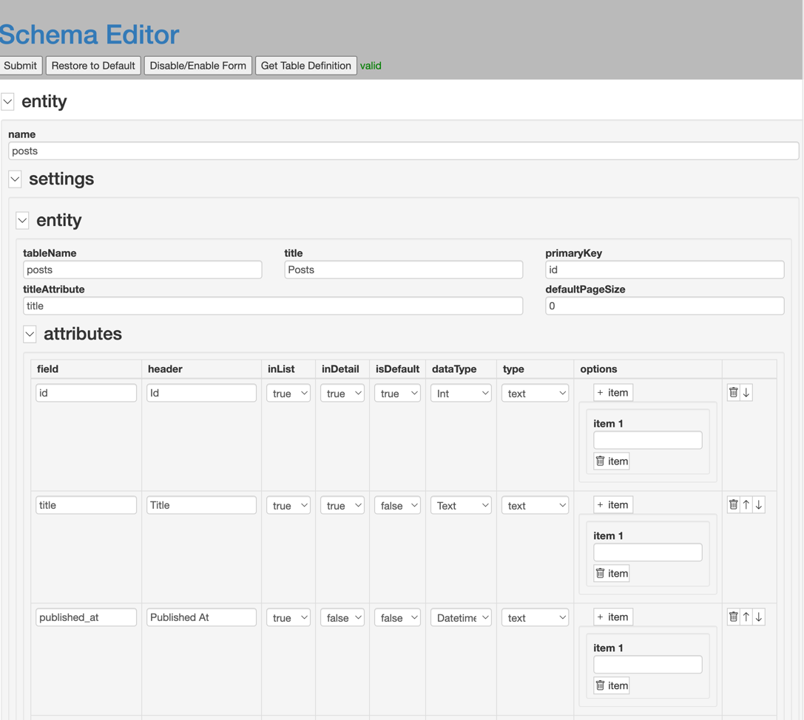

# Fluent CMS

## Why another CMS
As a developer, my normal workflow is:
1. Create tables and define relationships in databases.
2. Create APIs can create, read, update, delete data.
3. Create UI page for user to manage data.
ORMs, UI Frameworks can reduce the work, but still programmers are doing repetitive works.

When the first time I saw people using Wordpress Template build websites, I am amazed how a no-programmer, with on 
Knowledge of database at all, can build websites. After learn it database schema, I am amazed by Wordpress team's ideas
1. In Wordpress, every content-related entity is put in post, no matter, post, blog, product, event. Entity are 
differentiated by a discriminator post_type.
2. If you have a attribute not in Wordpress's Post table, you put attribute name, attribute value ask key-value pair 
to post meta.

By this approach, wordpress maximized it's flexibility, but Wordpress has it's limitations:
1. The unique design of the WordPress database schema makes it challenging to utilize the data outside of the WordPress environment.
2. For a single page request, WordPress needs to access the database multiple times, prioritizing flexibility over performance.
3. it's hard to add feature to Wordpress, you have to be familiar with Wordpress Hook and Plug-in to extend Wordpress.

Headless CMSs are becoming increasingly popular due to their flexibility and ability to 
deliver content across multiple platforms and devices. I have tried to build a web app based on Strapi.
I like strapi's idea of put schema's definition to a .json file, so we can easily add new entities and extend entities.
But the overall developing experience with Strapi is not good.
1. it's hard to extend strapi's feature, without strong type(strapi is written in node.js), it's very hard to extend a strapi API.
2. strapi's performance is also not good, again, strapi team is also tread performance for flexibility.

So I think why not build a CMS myself, using the language and framework I am comfortable with. It's not difficult with 
right tools and focus. 
## System overview

### Frontend UI
For demo purpose, I build a frontend presentation App based on stablo's next.js template. Thanks for stablo's nice and clean template.
- next.js
- stablo https://github.com/web3templates/stablo

### Admin UI
- react
- prime react https://primereact.org/
- swr https://swr.vercel.app/

### Schema Editor
- json-editor https://github.com/json-editor/json-editor

### Server
- asp.net core
- entity framework core
- sqlkata, it using dapper ORM behind the scene(https://sqlkata.com/)

Both entity framework and sqlkata can abstract query from specific Database dialect, so I extract database access to 
another layer, currently fluent-cms support postgres sql, it can easily support SQL Server and MySQL in the future. 

## Play With it using Docker

## Development

