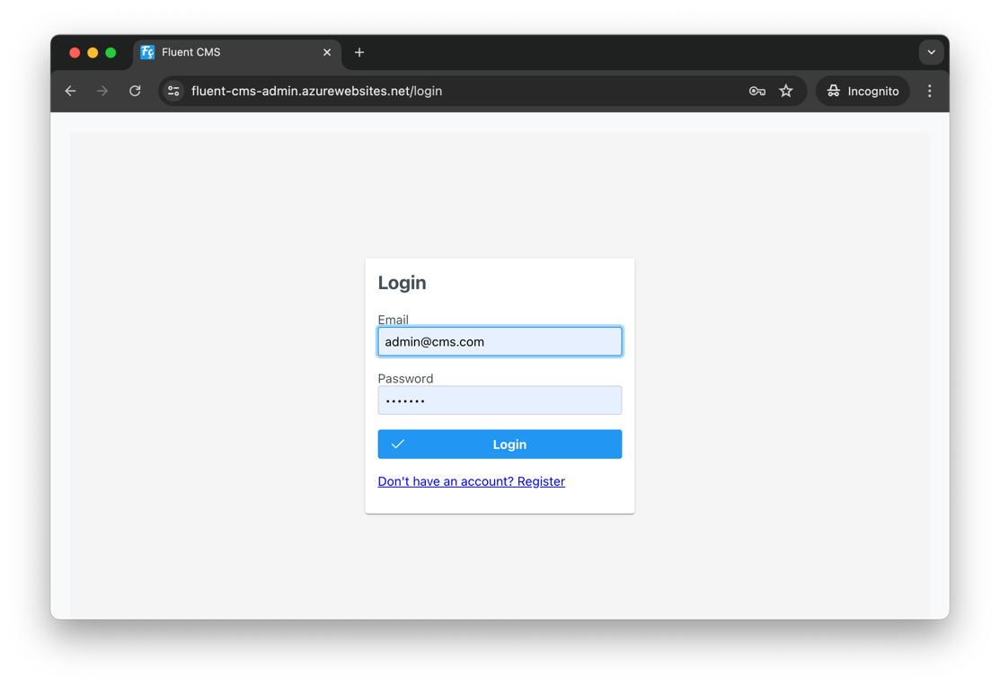
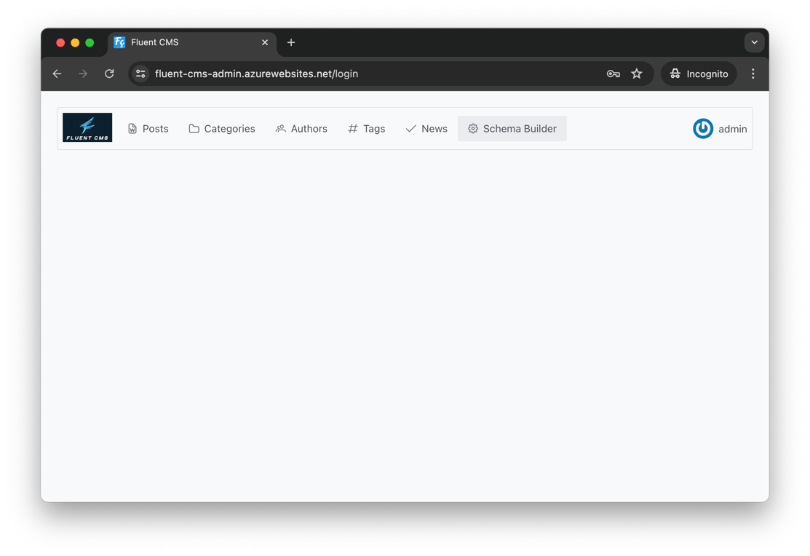
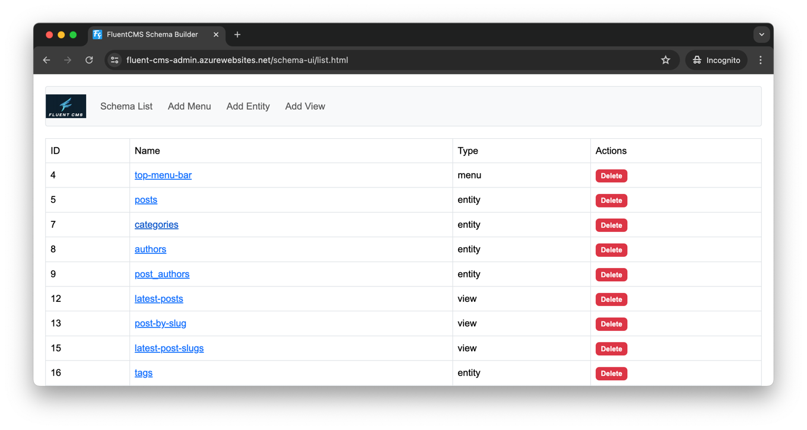
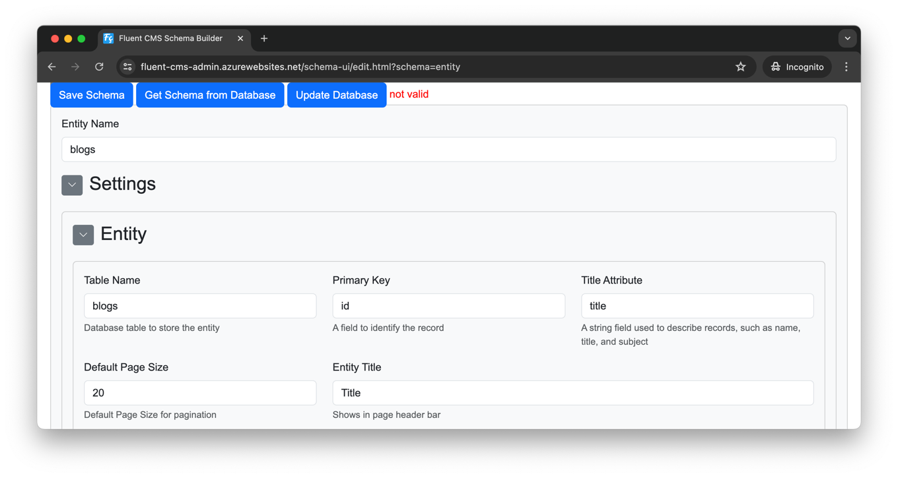
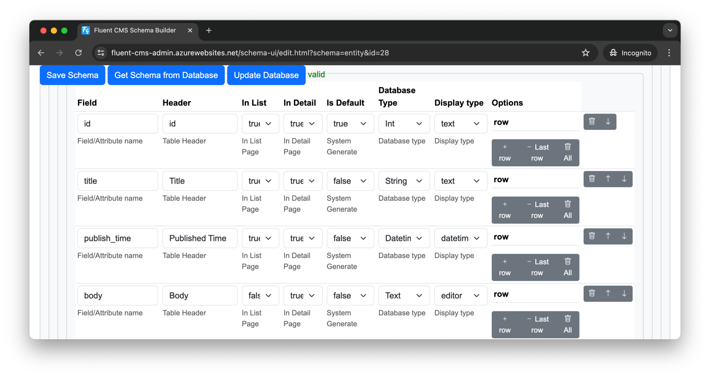
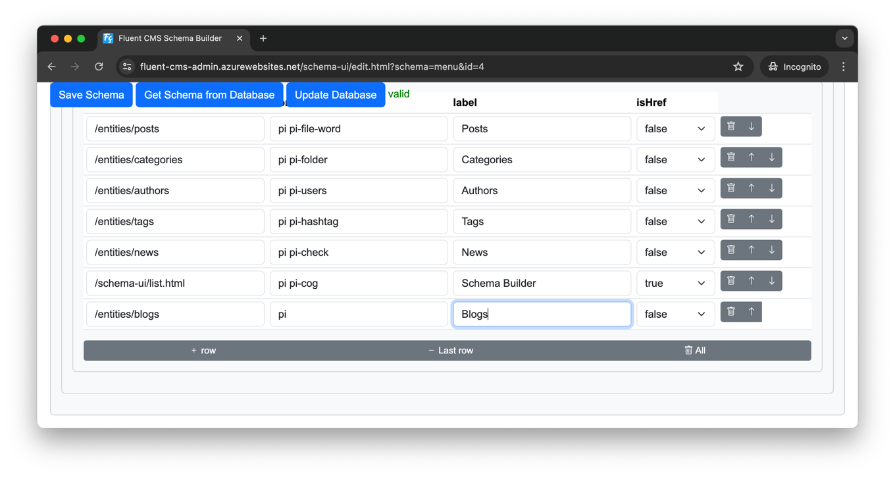
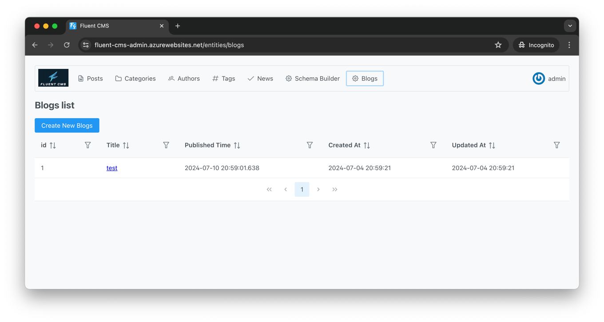

# Fluent CMS
## Demo / Quick Start
- Admin Panel https://fluent-cms-admin.azurewebsites.net/
  - Email: admin@cms.com
  - Password: Admin1!  
- Public Site : https://fluent-cms-ui.azurewebsites.net/

For examples, you are developing a cooking blog and you need:
1. An admin panel to manage blog content.
2. REST APIs for mobile and web clients.

With Fluent CMS, there's no need for coding—just some configuration.

### Add entity
1. Go to Admin Panel https://fluent-cms-admin.azurewebsites.net/,  use Email 'admin@cms.com', Password Admin1! to login.    

2. Go to Schema Builder by click the Menu Item  'Schema Builder'   

3. Go To Add Entity Page by click the Menu Item  'Add Entity'

4. In the Add Entity Page

input the following fields
   - Entity name: blogs
   - Table name: blogs
   - Primary Key: id
   - Title Attribute: title
   - Default Page Size: 20
   - Entity Title : Blogs
5. Now add some attributes to entity

   - title
   - published_time   {Database Type: Datetime, Display Type: DateTime}
   - body {Database Type: Text, Display Type: Editor}
Then click the update Database button to save
6. Add Menu item for Admin Panel
click 'Schema List', then edit the top-menu-bar, add a new item, {url: /entity/blogs, label:Blogs, icon: pi pi-check}

7. Now you can go to the Admin Panel to add post, Click the 'Fluent CMS' logo, go to Admin Panel
You can see a new menu item 'Blogs was added', now you can manage content



## System overview


## Why another CMS
The typical workflow for web development involves:


The normal workflow for web development is:
1. Backend Developers creating tables and defining relationships in databases.
2. Backend Developers creating APIs to perform CRUD (Create, Read, Update, Delete) operations on data.
3. Frontend Developers creating web pages that call these APIs.

Although ORMs and UI frameworks can reduce some of this work, developers often find themselves repeating the same tasks. 
As projects progress, adding or removing fields in tables necessitates changes to both the frontend and backend code, 
which in turn requires redeploying both applications.

Fluent CMS addresses this issue by not hardcoding the backend and frontend to specific entities. 
Instead, they read the schema definition to generate APIs. 
This means that changing an entity attribute only requires updating the schema definition in the schema builder.

For example, in the provided food/cooking blog demo, the product manager wants to add a "reading_time" attribute to the post entity.   


To meet this requirement, developers do not need to change any code. The workflow is as follows:

Add a "reading_time" field to the "posts" table.
In the schema builder, add the "reading_time" attribute.    


The new field will appear in the admin portal:    


And the attribute will be added to the REST API JSON payload:    


## Play With it using Docker
Assuming you have Docker and Docker Compose installed, follow these steps:

1. clone the repository
```shell
git clone https://github.com/fluent-cms/fluent-cms
```
2. bring up services
```shell
cd fluent-cms-sqlite-docker
docker-compose up
```
3. You can now explore the app:
-   Manage content at http://localhost:8080 using username admin@cms.com and password Admin1!
-   View the demo frontend at http://localhost:3000

## Development

### Server
- asp.net core
- entity framework core
- sqlkata, it using dapper ORM behind the scene(https://sqlkata.com/)

Both entity framework and sqlkata can abstract query from specific Database dialect, so I extract database access to
another layer, currently fluent-cms support postgres sql, it can easily support SQL Server and MySQL in the future. 

